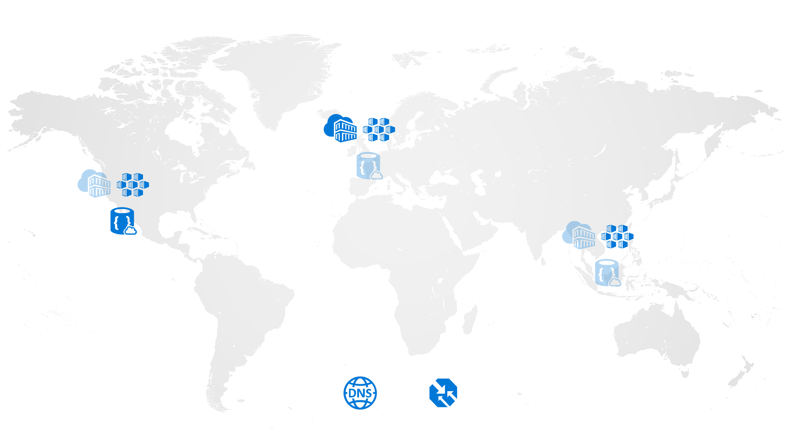

# How to setup a Globally Distributed Kubernetes cluster on Azure

One of the major asks we see with customers embarking on their Kubernetes journey is to be able to federate clusters globally.

Kubernetes Federation is still in Alpha status, and as such is not Production ready (yet).

One way to provide a level of global distribution of Kubernetes workloads is to utilise data replication and availability, as well as dispersing the load across those clusters in an intelligent fashion.

## Components to be used
* Azure ACS
* CosmosDB
* Azure Traffic Manager
* Azure Container Registry

## Proposed Architecture


An ACS cluster will be deployed into:
* West US
* UK South
* Southeast Asia

Replicated Azure Container Registry will be used to make sure Docker images are as close to the clusters as possible for speedy deployment.

CosmosDB will be created with its Write Master in West US, with read replicas in the UK and Asia regions.

Traffic Manager will be used to distribute traffic to the services published in each cluster with a unified endpoint.  This will provide performance based routing, as well as service availability.

## Services used
We will use two services to demonstrate this architecture

### StreamTweets
A python script to stream tweets from the Twitter firehose that references the term "Docker".  These will be saved in the CosmosDB Write master, and replicated automatically to the other read replicas.

### Frontend
A Ruby on Rails (RoR) web app to display the tweets from the local CosmosDB instance.


# Pre-requisites
[Azure CLI](https://docs.microsoft.com/en-us/cli/azure/install-azure-cli?view=azure-cli-latest)

[Docker](http://docker.com)
# Link az cli to your subscription
```
➜  KubeOnAzure (master) ✗ az login

To sign in, use a web browser to open the page https://aka.ms/devicelogin and enter the code D52DYHQH8 to authenticate.

```

# Create Resource Groups
Create a resource group for the operational services (CosmosDB, ACR and Traffic Manager)

```
 ➜  KubeOnAzure (master) ✗ az group create -n kubeonazure-backing -l uksouth
Location    Name
----------  -------------------
uksouth     kubeonazure-backing
```


# Create Azure Container Registries
To be able to takr advantage of the replicated registies, you will need to create an ACR instance under the Premium SKU

```
➜  KubeOnAzure (master) ✗ az acr create -n judaregistry -g kubeonazure-backing --sku Premium --admin-enabled true

Create a new service principal and assign access:
  az ad sp create-for-rbac --scopes /subscriptions/XXXXXXXXXXXXXXXXXX/resourceGroups/kubeonazure-backing/providers/Microsoft.ContainerRegistry/registries/judaregistry --role Owner --password <password>

Use an existing service principal and assign access:
  az role assignment create --scope /subscriptions/XXXXXXXXXXXXXXXXXX/resourceGroups/kubeonazure-backing/providers/Microsoft.ContainerRegistry/registries/judaregistry --role Owner --assignee <app-id>
NAME          RESOURCE GROUP       LOCATION    SKU      LOGIN SERVER             CREATION DATE                     ADMIN ENABLED    STATUS
------------  -------------------  ----------  -------  -----------------------  --------------------------------  ---------------  --------
judaregistry  kubeonazure-backing  uksouth     Premium  judaregistry.azurecr.io  2017-11-14T11:02:27.923465+00:00  True             None
```

## Configure replication
We want to replicate data from the registry to the West US and Southeast Asia regions:

```
➜  KubeOnAzure (master) ✗ az acr replication create -r judaregistry -l westus
NAME    RESOURCE GROUP       LOCATION    STATUS
------  -------------------  ----------  --------------------------------------------------------------------------------------------
westus  kubeonazure-backing  westus      {'displayStatus': 'Ready', 'message': None, 'timestamp': '2017-11-14T11:23:25.386035+00:00'}
```

```
 ➜  KubeOnAzure (master) ✗ az acr replication create -r judaregistry -l southeastasia
NAME           RESOURCE GROUP       LOCATION       STATUS
-------------  -------------------  -------------  --------------------------------------------------------------------------------------------
southeastasia  kubeonazure-backing  southeastasia  {'displayStatus': 'Ready', 'message': None, 'timestamp': '2017-11-14T11:24:33.551635+00:00'}
```

# Login an push a container
Use docker to login to the newly created registry and tag an image to test everything works

## Get the admin password
```
➜  KubeOnAzure (master) ✗ az acr credential show -n judaregistry
USERNAME      PASSWORD                          PASSWORD2
------------  --------------------------------  --------------------------------
judaregistry  uvMf9FdjYWT9jgSW5Q1pGez9Hw+JglO7  mJQMAcavf3qd1KN+1VqeO75bB721cbd6
```

## Login to the registry
```
➜  KubeOnAzure (master) ✗ docker login judaregistry.azurecr.io
Username: judaregistry
Password:
Login Succeeded
```

## Pull NGINX

```
➜  KubeOnAzure (master) ✗ docker pull nginx
Using default tag: latest
latest: Pulling from library/nginx
bc95e04b23c0: Pull complete
a21d9ee25fc3: Pull complete
9bda7d5afd39: Pull complete
Digest: sha256:9fca103a62af6db7f188ac3376c60927db41f88b8d2354bf02d2290a672dc425
Status: Downloaded newer image for nginx:latest
```

## Tag to the registry and push

```
➜  KubeOnAzure (master) ✗ docker tag nginx judaregistry.azurecr.io/nginx

➜  KubeOnAzure (master) ✗ docker push judaregistry.azurecr.io/nginx
The push refers to repository [judaregistry.azurecr.io/nginx]
f4cc3366d6a9: Pushed
bba7659ae2e7: Pushed
cec7521cdf36: Pushed
latest: digest: sha256:278fefc722ffe1c36f6dd64052758258d441dcdb5e1bbbed0670485af2413c9f size: 948
```

# Create ACS Clusters

The first thing we need to do is to create the ACS Kuberbetes clusters resource groups

```
➜  KubeOnAzure (master) ✗ az group create -n juda-uksouth -l uksouth
Location    Name
----------  ------------
uksouth     juda-uksouth

➜  KubeOnAzure (master) ✗ az group create -n juda-westus -l westus
Location    Name
----------  -----------
westus      juda-westus

➜  KubeOnAzure (master) ✗ az group create -n juda-southeastasia -l southeastasia
Location       Name
-------------  ------------------
southeastasia  juda-southeastasia
```

## Create Service Principal
The Service principal is required to provision the underlying Azure infrastructure.  Use the CLI to create the service principal, and keep the out safe!

```
 ➜  KubeOnAzure (master) ✗ az ad sp create-for-rbac --role="Contributor" --scopes="/subscriptions/63bb1026-40d0-4a59-b97d-8b343eefecb3" -o json
{
  "appId": "2ce010d6-57b0-48be-b874-f99faabc8341",
  "displayName": "azure-cli-2017-11-14-11-51-15",
  "name": "http://azure-cli-2017-11-14-11-51-15",
  "password": "deda51cb-05f1-4e84-a0aa-a46530663189",
  "tenant": "72f988bf-86f1-41af-91ab-2d7cd011db47"
}
```

## Define the clusters
ACS-Engine is going to be used here for a few reasons

* I like it!
* It generates Infrastructure as Code - good for re-use
* AKS, and ACS RPv2 is not available in all regions we need to replicate to

```
{
    "apiVersion": "vlabs",
    "properties": {
      "orchestratorProfile": {
        "orchestratorType": "Kubernetes"
      },
      "masterProfile": {
        "count": 1,
        "dnsPrefix": "juda",
        "vmSize": "Standard_D2_v2"
      },
      "agentPoolProfiles": [
        {
            "name": "linuxpool1",
            "count": 2,
            "vmSize": "Standard_D2_v2",
            "availabilityProfile": "AvailabilitySet",
            "osType": "Linux"
          }
      ],

      "linuxProfile": {
        "adminUsername": "juda",
        "ssh": {
          "publicKeys": [
            {
              "keyData": "YOUR_SSH_PUBLIC_KEY"
            }
          ]
        }
      },
      "servicePrincipalProfile": {
        "clientId": "2ce010d6-57b0-48be-b874-f99faabc8341",
        "secret": "deda51cb-05f1-4e84-a0aa-a46530663189"
      }
    }
  }
```

## Generate the ARM teamplate for deployment
Once the cluster definition has been saved, use [ACS-Engine](http://github.com/Azure/acs-engine) to generate the ARM templates for deployment

```
➜  GloballyDistributed (master) ✗ ~/GitHub/acs-engine-v0.8.0-linux-amd64/acs-engine generate kube-cluster.json
INFO[0000] Generating assets into _output/juda...
```

### Layout of the _output directory
The output generated by ACS Engine includes the ARM template (azuredeploy.json) as well as the ARM paramaters (azuredeploy.parameters.json) and the corresponding keys and certificates used during deployment.

```
➜  juda (master) ✗ ls -lrt
total 196
-rwxrwxrwx 1 root root  24992 Nov 14 12:02 apimodel.json
-rwxrwxrwx 1 root root 101497 Nov 14 12:02 azuredeploy.json
-rwxrwxrwx 1 root root  34625 Nov 14 12:02 azuredeploy.parameters.json
drwxrwxrwx 0 root root    512 Nov 14 12:02 kubeconfig
-rwxrwxrwx 1 root root   3243 Nov 14 12:02 ca.key
-rwxrwxrwx 1 root root   1716 Nov 14 12:02 ca.crt
-rwxrwxrwx 1 root root   3247 Nov 14 12:02 apiserver.key
-rwxrwxrwx 1 root root   3918 Nov 14 12:02 apiserver.crt
-rwxrwxrwx 1 root root   3243 Nov 14 12:02 client.key
-rwxrwxrwx 1 root root   1781 Nov 14 12:02 client.crt
-rwxrwxrwx 1 root root   3243 Nov 14 12:02 kubectlClient.key
-rwxrwxrwx 1 root root   1781 Nov 14 12:02 kubectlClient.crt
```

### Kubeconfig directory
One of the very nice things ACS-Engine does for you is to create kubeconfig files for each possible region to deploy to.  This will come in very useful when using the Kube contexts later during service deployment.

# Deploy the clusters

You might need a :coffee: for this step as we will be deploying three clusters.

As we now have the cluster definition, we need to deploy this into each of the resource groups created earlier


```
➜  juda (master) ✗ az group deployment create --name juda-uksouth -g juda-uksouth --template-file ./azuredeploy.json --parameters ./azuredeploy.parameters.json --no-wait

➜  juda (master) ✗ az group deployment create --name juda-westus -g juda-westus --template-file ./azuredeploy.json --parameters ./azuredeploy.parameters.json --no-wait

➜  juda (master) ✗ az group deployment create --name juda-southeastasia -g juda-southeastasia --template-file ./azuredeploy.json --parameters ./azuredeploy.parameters.json --no-wait

```

## Monitor the deployment

```
➜  juda (master) ✗for i in juda-uksouth juda-westus juda-southeastasia; do  az group deployment list -g $i; done

Name          Timestamp                         State
------------  --------------------------------  -------
juda-uksouth  2017-11-14T12:13:09.582212+00:00  Running
Name         Timestamp                         State
-----------  --------------------------------  -------
juda-westus  2017-11-14T12:13:47.819006+00:00  Running
Name                Timestamp                         State
------------------  --------------------------------  -------
juda-southeastasia  2017-11-14T12:14:04.745698+00:00  Running
```

# Create CosmosDB instance
CosmosDB is Microsoft's globally distributed, multi model database, and is perfect to preserve state in your applications.  Once of the added benefits that comes with it is that it supports MongoDB protocol out of the box.  This means that if I've been writing an app that backs onto Mongo on my laptop, I can change the connection string to point at Cosmos and it will just work.

If you want to learn more about CosmosDB and how it works, take a look at [Rimma Nehme's slides from PASS Summit](https://www.dropbox.com/s/bu5oijxisv5gbv0/PASS_SUMMIT_2017_KEYNOTE_Rimma.pdf?dl=0).

Let's create the Cosmos instance, enabling the locations we are working within, as well as automatic failover for the Write master.

```
➜  juda (master) ✗ az cosmosdb create -n juda -g kubeonazure-backing --kind MongoDB --locations westus=0 uksouth=1 southeastasia=2 --enable-automatic-failover true
DatabaseAccountOfferType    DocumentEndpoint                       EnableAutomaticFailover    Kind     Location    Name    ProvisioningState
  ResourceGroup
--------------------------  -------------------------------------  -------------------------  -------  ----------  ------  -------------------
  -------------------
Standard                    https://juda.documents.azure.com:443/  True                       MongoDB  UK South    juda    Succeeded
  kubeonazure-backing
```

## Get the connection string
Once the CosmosDB instance has been created, get the connection string.  This will be used for both the Twitter Stream app to write, and the Web App to read data.

```
➜  juda (master) ✗ az cosmosdb list-connection-strings -g kubeonazure-backing -n juda -o json
{
  "connectionStrings": [
    {
      "connectionString": "mongodb://juda:DniE95rrmdCnZJRDZlpICl8Zz6oxgriM0sdoJSJTIsfH9K2acIAAxFnqinT9dEcRDJKHcrcrsh2RHzjPM2xJEA==@juda.documents.azure.com:10255/?ssl=true",
      "description": "Default MongoDB Connection String"
    }
  ]
}

```

# Map Kubernetes Contexts
The ACS-Engine output also generate kubeconfig files for each region you would be able to deploy into.  Open the three files for uksouth, westus and southeastasia, and change the name of the cluster and context to append the region name (this allows you to reference them using kubectl).

```
{
    "apiVersion": "v1",
    "clusters": [
        {
            "cluster": {
                "certificate-authority-data": "LS0tLS1CRUdJTiBDRVJUSUZJQ0FURS....",
                "server": "https://juda.uksouth.cloudapp.azure.com"  
            },
            "name": "juda-uksouth"
        }
    ],
    "contexts": [
        {
            "context": {
                "cluster": "juda-uksouth",
                "user": "juda-admin"
            },
            "name": "juda"
        }
    ],
    "current-context": "juda-uksouth",
    "kind": "Config",
    "users": [
        {
            "name": "juda-admin",
            "user": {"client-certificate-data":"LS0tLS1CRUd...=","client-key-data":"LS0tLS1CRUdJ..."}
        }
    ]
}
```

Finally, export the KUBECONFIG environment variable to reference the configuration for the clusters that have just been created.

```
➜  kubeconfig (master) ✗  export KUBECONFIG=/home/justin/.kube/config:/home/justin/GitHub/KubeOnAzure/GloballyDistributed/_output/juda/kubeconfig/kubeconfig.uksouth.json:/home/justin/GitHub/KubeOnAzure/GloballyDistributed/_output/juda/kubeconfig/kubeconfig.westus.json:/home/justin/GitHub/KubeOnAzure/GloballyDistributed/_output/juda/kubeconfig/kubeconfig.southeastasia.json
```

## Test contexts
Once the KUBECONFIG environment variable has been set, check that it has been picked up by kubectl.

```
➜  kubeconfig (master) ✗ kubectl config get-contexts
CURRENT   NAME                 CLUSTER              AUTHINFO     NAMESPACE
          juda-uksouth         juda-uksouth         juda-admin
          juda-westus          juda-westus          juda-admin
          juda-southeastasia   juda-southeastasia   juda-admin
```

And now lets check that we can talk to the clusters

```
➜  kubeconfig (master) ✗ kubectl config use-context juda-uksouth
Switched to context "juda-uksouth".
(stream) ➜  kubeconfig (master) ✗ kubectl get node
NAME                        STATUS    AGE       VERSION
k8s-linuxpool1-87569554-0   Ready     2h        v1.7.7
k8s-linuxpool1-87569554-1   Ready     2h        v1.7.7
k8s-master-87569554-0       Ready     2h        v1.7.7
```

N.B. Whenever actions are taken across the clusters, the context will need to be changed

# Operational Burden
One of the major advantages of Kubernetes federation is that you have one control plane.  With globally disparate clusters there is operational overhead in deploying applications and configuration as in this example it has to be done three times.

# Deploy Secrets
Secrets will need to be created across the clusters for the imagePullSecrets.  This is the same information used for the docker login command earlier, but applying this to the Kubernetes cluster so it is able to pull down images from the private registry we created.

The command per cluster is as follows:

```
➜  kubeconfig (master) ✗ kubectl create secret docker-registry myregistrykey --docker-server=juda.azurecr.io --docker-username=juda --docker-password=uvMf9FdjYWT9jgSW5Q1pGez9Hw+JglO7 --docker-email=juda@microsoft.com
```

But to save time, we can also use a one-liner to switch context and create the secret in one go:

```
➜  kubeconfig (master) ✗ for i in uksouth westus southeastasia; do kubectl config use-context juda-${i}; kubectl create secret docker-registry myregistrykey --docker-server=juda.azurecr.io --docker-username=juda --docker-password=uvMf9FdjYWT9jgSW5Q1pGez9Hw+JglO7 --docker-email=juda@microsoft.com; done

Switched to context "juda-uksouth".
secret "myregistrykey" created
Switched to context "juda-westus".
secret "myregistrykey" created
Switched to context "juda-southeastasia".
secret "myregistrykey" created
```

# Build applications and push to the registry
As discussed previously there are two applications in this Architecture.  All three are within this directory, listed as:

* Streamer
* Frontend

Within each directory is the Dockerfile that should be used to construct the image.

## Streamer
Streamer is a simple Python script to push Tweets into CosmosDB that matches the term "docker".  For this to work, an Application will need to be created in your Twitter account so that you can use the Twitter API.  For this, goto [https://apps.twitter.com](https://apps.twitter.com) and create a new application.  Take note of the tokens and keys as these need to be set in the environment of Streamer itself.

### Build Streamer Docker Image
```
➜  StreamTweets (master) ✗ docker build -t judaregistry.azurecr.io/kubeonazure:streamer .
Sending build context to Docker daemon   7.68kB
Step 1/5 : FROM python:2
 ---> 5ca9b5ba555d
Step 2/5 : COPY requirements.txt /
 ---> Using cache
 ---> a7b30a2160e1
Step 3/5 : RUN pip install -r requirements.txt
 ---> Using cache
 ---> 5a48bb9ec152
Step 4/5 : COPY stream.py /
 ---> Using cache
 ---> 60091cffa3c0
Step 5/5 : CMD python stream.py
 ---> Using cache
 ---> a79b53bf9475
Successfully built a79b53bf9475
Successfully tagged judaregistry.azurecr.io/kubeonazure:streamer
(stream) ➜  StreamTweets (master) ✗ docker push judaregistry.azurecr.io/kubeonazure:streamer
The push refers to repository [judaregistry.azurecr.io/kubeonazure]
dfe3c59eaf79: Pushed
d9b2b158accf: Pushed
7700391d9bde: Pushed
0e53623ae6e4: Pushed
f4b998c37348: Pushed
a90943ac6bba: Pushed
92a2671098b7: Pushed
8686c6b8d999: Pushed
44b57351135e: Pushed
00b029f9aa09: Pushed
18f9b4e2e1bc: Pushed
streamer: digest: sha256:334037b3c47eab88d6977633d0aec83a74063fdb50ff5f3bfbbc4b81de095bd7 size: 2636
```

### Deploy Streamer to West US
As the Mongo write master is based out of the West US region, we will want to deploy the Streamer application within region to reduce latency.

```
➜  StreamTweets (master) ✗ kubectl config use-context juda-westus
Switched to context "juda-westus".

➜  StreamTweets (master) ✗ kubectl create -f deploy.yml
deployment "streamer" created
```

Take a look in the portal (Data Explorer) to check that Tweets are being saved


## Frontend
The Frontend application is Ruby on Rails, using mongoid as the ODM driver.  

### Build Frontend Docker Image
Use the Dockerfile within the Frontend directory to build the container and push to the registry.

```
➜  Frontend (master) ✗ docker build -t judaregistry.azurecr.io/kubeonazure:frontend .
Sending build context to Docker daemon  6.993MB
Step 1/12 : FROM ruby:2.2.3-slim
 ---> 92b7501c276a
Step 2/12 : MAINTAINER Justin Davies
 ---> Using cache
 ---> 4a96697decd4
Step 3/12 : RUN apt-get update && apt-get install -qq -y build-essential nodejs libsqlite3-dev --fix-missing --no-install-recommends
 ---> Using cache
 ---> 916667059972
Step 4/12 : ENV INSTALL_PATH /kubeglobal
 ---> Using cache
 ---> 60baccfb3242
Step 5/12 : RUN mkdir -p $INSTALL_PATH
 ---> Using cache
 ---> 6018e8ecd3d2
Step 6/12 : WORKDIR $INSTALL_PATH
 ---> Using cache
 ---> e1750949711e
Step 7/12 : COPY Gemfile Gemfile
 ---> Using cache
 ---> 3a4189e4f3de
Step 8/12 : RUN bundle install
 ---> Using cache
 ---> 28fdea59d943
Step 9/12 : EXPOSE 8080
 ---> Using cache
 ---> f7ccba748a7a
Step 10/12 : COPY . .
 ---> a9d65d4ee0f2
Step 11/12 : RUN bundle exec rake RAILS_ENV=production SECRET_TOKEN=pickasecuretoken assets:precompile
Removing intermediate container 95cc53fb6088
 ---> 3bed151c7b56
Step 12/12 : CMD bundle exec unicorn -E production -c config/unicorn.rb
 ---> Running in 2f087f4f79d6
Removing intermediate container 2f087f4f79d6
 ---> fb95d66a2930
Successfully built fb95d66a2930
Successfully tagged judaregistry.azurecr.io/kubeonazure:frontend

```

### Deploy Frontend to all clusters
Let's use the same pattern as with the secrets creation to deploy the Frontend application to all clusters.

```
➜  Frontend (master) ✗ for i in uksouth westus southeastasia; do kubectl config use-context juda-${i}; kubectl create -f deploy_${i}.yml; done

Switched to context "juda-uksouth".
deployment "frontend" created
service "frontend" created
Switched to context "juda-westus".
deployment "frontend" created
service "frontend" created
Switched to context "juda-southeastasia".
deployment "frontend" created
service "frontend" created
```

# Configure Traffic Manager
The Service configuration for the Frontend also publishes the Web App to an Azure LoadBalancer.  The first step to configuring Traffic Manager is to make sure each IP Address has an A record associated with it.

Check what the Services are published and have an IP address

```
➜  Frontend (master) ✗ for i in uksouth westus southeastasia; do kubectl config use-context juda-${i}; kubectl get svc; done
Switched to context "juda-uksouth".
^[OANAME         CLUSTER-IP     EXTERNAL-IP      PORT(S)        AGE
frontend     10.0.224.176   51.140.184.161   80:32650/TCP   3m
kubernetes   10.0.0.1       <none>           443/TCP        3h
Switched to context "juda-westus".
NAME         CLUSTER-IP     EXTERNAL-IP    PORT(S)        AGE
frontend     10.0.114.202   13.91.48.142   80:31204/TCP   3m
kubernetes   10.0.0.1       <none>         443/TCP        3h
Switched to context "juda-southeastasia".
NAME         CLUSTER-IP   EXTERNAL-IP    PORT(S)        AGE
frontend     10.0.111.3   52.187.13.74   80:31622/TCP   3m
kubernetes   10.0.0.1     <none>         443/TCP        3h
```

## Create A record for Service Public IP address
Login to the [portal](http://portal.azure.com) and goto "Public IP Addresses".


You can tell the IP addresses in question as they will be the only ones listed in the portal in the Resource Group that are not the Kubernetes Masters.

Select each IP address, and allocate an A record.


Repeat for each Service address.

## Deploy Traffic Manager Profile
We will use Traffic Manager in Performance mode, which will choose the best Endpoint for the user based on Service latency.  

```
➜  Frontend (master) ✗ az network traffic-manager profile create -n juda -g kubeonazure-backing --routing-method Performance --unique-dns-name juda
```

### Assign endpoints to Profile
The final step is to now add the Service endpoint for each Frontend service globally into the Traffic Manager Profile

Login to the [portal](http://portal.azure.com) again, and select your Traffic Manager instance.  Click on "Endpoints" and assign each Service IP address to the TM instance.


# Test it!
We've now set everything up to be able to test the Traffic Manager's global presence. In the case of this walkthrough, the URL for the Traffic Manager endpoint is [http://juda.trafficmanager.net/](http://juda.trafficmanager.net/)


## Create a CNAME to Traffic Manager

The final part of this is to then use your DNS provider (or Azure DNS) to point a FQDN to the Traffic Manager endpoint using a CNAME.

You now have a globally distributed, globally replicated number of Kubernetes clusters ready to go.